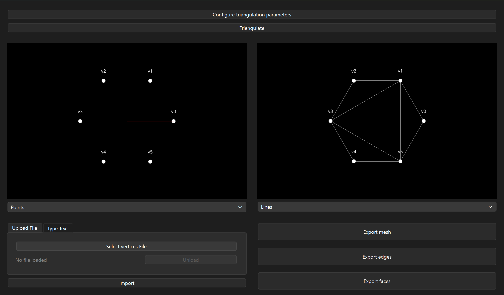

# Surface Triangulation



A Python-based application for solving surface triangulation problems using mathematical optimization. This tool allows you to generate optimal triangulations from sets of candidate vertices, edges, and faces based on customizable objectives and constraints.

## Features

-   **Optimization-Based Triangulation**: Uses the Gurobi Optimizer to find the global optimum for triangulation problems.
-   **Customizable Objectives**: multiple optimization criteria including:
    -   Minimize total edge length
    -   Minimize number of triangles
    -   Maximize minimum angle (avoid skinny triangles)
    -   Minimize maximum angle
    -   Maximize area uniformity
    -   Minimize energy
-   **Flexible Constraints**: Define boundary edges and other constraints to guide the solution.
-   **Interactive GUI**: Built with PyQt6 for visualizing meshes and controlling parameters.
-   **Mesh Support**: Load meshes from common formats (using Trimesh) or csv text formats.

## Prerequisites

-   **Python**: >= 3.13
-   **Poetry**: Dependency management.
-   **Gurobi**: You need a valid Gurobi license to solve the optimization models.

## Installation

1.  Clone the repository:
    ```bash
    git clone git@github.com:khlkarim/surface-triangulation.git
    cd surface-triangulation
    ```

2.  Install dependencies using Poetry:
    ```bash
    poetry install
    ```

## Usage

### Running the GUI

To launch the interactive application:

```bash
poetry run main
```

The GUI allows you to load files, configure solver settings, and visualize the resulting triangulation.

### Programmatic Usage

You can also use the core logic directly in your Python scripts.

```python
from surface_triangulation.core.models.triangulation_problem import TriangulationProblem
from surface_triangulation.core.models.triangulation_objectives import TriangulationObjective
from surface_triangulation.solvers.gurobi.gurobi_triangulation_service import GurobiTriangulationService

# 1. Define your problem data
# Example: single triangle candidate
vertices = [
    (0.0, 0.0, 0.0),
    (1.0, 0.0, 0.0),
    (0.0, 1.0, 0.0)
]
candidate_faces = [
    (0, 1, 2)
]
candidate_edges = [
    (0, 1), (1, 2), (2, 0)
]

# 2. Create the problem instance
problem = TriangulationProblem(
    vertices=vertices,
    candidate_edges=candidate_edges,
    candidate_faces=candidate_faces,
    objective=TriangulationObjective.MINIMIZE_TOTAL_LENGTH
)

# 3. Solve using the Gurobi service
solver = GurobiTriangulationService()
solution = solver.solve(problem)

# 4. Process results
if solution.is_feasible:
    print(f"Objective Value: {solution.objective_value}")
    print(f"Selected Faces: {solution.selected_faces}")
else:
    print("No feasible triangulation found.")
```

## Project Structure

-   `src/surface_triangulation/core`: Core data models and interfaces.
-   `src/surface_triangulation/solvers`: Implementation of solvers (Gurobi).
-   `src/surface_triangulation/ui`: PyQt6 application and UI components.
-   `src/surface_triangulation/mesh_io`: Services for loading and saving mesh data.