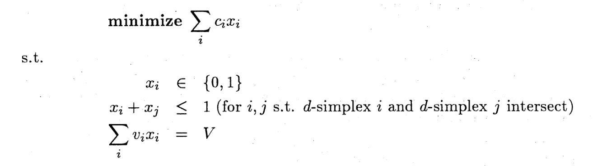
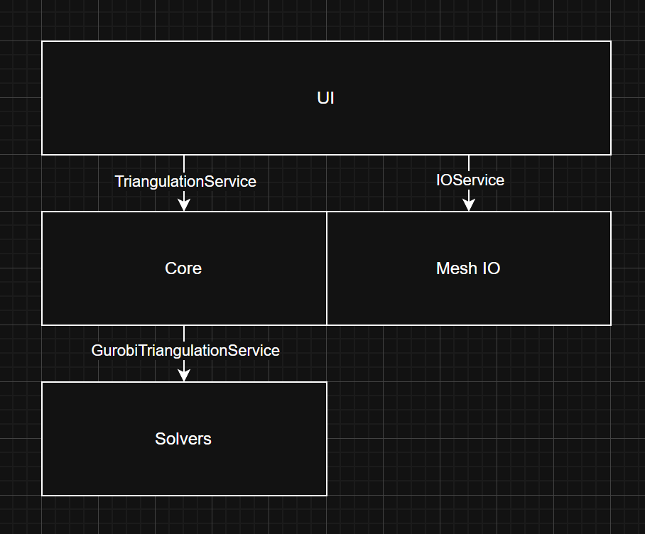

# Rapport de Projet : Triangulation de Surfaces par Programmation Linéaire en Nombres Entiers

---

## Page de garde

**Titre du projet :** Triangulation: Rendu 3D et maillage d'objets.  
**Auteur :** Karim Khili  
**Date :** Décembre 2025  
**Établissement :** INSAT  

---

## Liste des acronymes, notation et glossaire

| Acronyme/Terme | Signification |
|----------------|---------------|
| IP | Integer Programming (Programmation Linéaire en Nombres Entiers) |
| MILP | Mixed Integer Linear Programming |
| 2D | Deux dimensions |
| 3D | Trois dimensions |
| GUI | Graphical User Interface (Interface Graphique Utilisateur) |
| MVC | Model-View-Controller |
| PyQt6 | Framework Python pour interfaces graphiques |
| Gurobi | Solveur d'optimisation commerciale |
| Shapely | Bibliothèque Python de géométrie computationnelle 2D |
| Trimesh | Bibliothèque Python pour le traitement de maillages 3D |
| VisPy | Bibliothèque Python pour la visualisation scientifique |
| Loguru | Bibliothèque Python pour la journalisation |
| Poetry | Système de gestion de dépendances Python |

**Notation mathématique :**
- `n` : nombre de sommets
- `k` : nombre de sommets sur l'enveloppe convexe
- `M = 3n - k - 3` : nombre d'arêtes dans une triangulation 2D valide

---

## Résumé

Ce rapport présente le développement d'un outil d'optimisation pour la triangulation de surfaces utilisant la programmation linéaire en nombres entiers. Le projet s'appuie sur des formulations mathématiques issues de la recherche académique pour résoudre le problème de triangulation de manière optimale selon différents critères (longueur totale, nombre de triangles, etc.). 

L'outil implémente deux formulations principales du problème de triangulation en 2D, utilise le solveur Gurobi pour l'optimisation, et propose une interface graphique interactive développée avec PyQt6. L'architecture modulaire du projet permet une séparation claire entre la logique métier, les solveurs d'optimisation et l'interface utilisateur, facilitant ainsi la maintenance et l'extensibilité du code.

---

## Sommaire

1. [Introduction Générale](#introduction-générale)
2. [Fondements Théoriques et Formulations](#fondements-théoriques-et-formulations)
   - 2.1 [Contexte et Motivation](#contexte-et-motivation)
   - 2.2 [Formulation 0 : Problème de Stable Set de d-Simplexes](#formulation-0--problème-de-stable-set-de-d-simplexes)
   - 2.3 [Formulation 1 : Problème de Stable Set de i-Simplexes](#formulation-1--problème-de-stable-set-de-i-simplexes)
3. [Architecture et Conception](#architecture-et-conception)
   - 3.1 [Modèles de Données](#modèles-de-données)
   - 3.2 [Architecture Modulaire](#architecture-modulaire)
   - 3.3 [Découplage Solveur-Application](#découplage-solveur-application)
4. [Implémentation](#implémentation)
   - 4.1 [Module Core : Modèles et Interfaces](#module-core--modèles-et-interfaces)
   - 4.2 [Module Solvers : Implémentation Gurobi](#module-solvers--implémentation-gurobi)
   - 4.3 [Module UI : Interface Graphique](#module-ui--interface-graphique)
   - 4.4 [Module Mesh I/O : Gestion des Fichiers](#module-mesh-io--gestion-des-fichiers)
5. [Objectifs et Contraintes](#objectifs-et-contraintes)
   - 5.1 [Fonctions Objectif](#fonctions-objectif)
   - 5.2 [Contraintes Implémentées](#contraintes-implémentées)
6. [Technologies et Outils](#technologies-et-outils)
7. [Tests et Validation](#tests-et-validation)
8. [Conclusion Générale](#conclusion-générale)
9. [Références Bibliographiques](#références-bibliographiques)

---

## Liste des figures

- Figure 1 : Formulation 0 - Problème de stable set de d-simplexes (`./images/formulation-0.png`)
- Figure 2 : Formulation 1 - Problème de stable set de i-simplexes (`./images/formulation-1.png`)
- Figure 3 : Architecture du système (`./images/architecture.png`)
- Figure 4 : Capture d'écran de l'interface - Vue principale (`./images/screenshot-1.png`)
- Figure 5 : Capture d'écran de l'interface - Résultat de triangulation (`./images/screenshot-2.png`)

---

## Liste des tableaux

- Tableau 1 : Comparaison des formulations de triangulation
- Tableau 2 : Objectifs d'optimisation supportés
- Tableau 3 : Contraintes disponibles
- Tableau 4 : Technologies et bibliothèques utilisées

---

## Introduction Générale

La triangulation de surfaces est un problème fondamental en géométrie computationnelle avec de nombreuses applications en infographie, modélisation 3D, analyse par éléments finis, et traitement de maillages. Traditionnellement, l'algorithme de triangulation de Delaunay a été la méthode de référence pour générer des triangulations de qualité. Cependant, comme le souligne la littérature académique, **"La triangulation de Delaunay n'est pas très efficace en trois dimensions ou plus."**.

Avec l'augmentation de la puissance de calcul des ordinateurs modernes et le besoin croissant d'applications de triangulation dans des contextes variés, les formulations par programmation linéaire en nombres entiers (Integer Programming) deviennent une alternative viable et intéressante. Ces approches permettent non seulement de garantir l'optimalité globale selon un critère donné, mais aussi d'intégrer facilement des contraintes complexes et des objectifs multiples.

### Objectifs du Projet

Ce projet vise à développer un outil complet pour la triangulation optimale de surfaces en utilisant la programmation linéaire en nombres entiers. Les objectifs principaux sont :

1. **Implémenter des formulations mathématiques rigoureuses** : Traduire les formulations théoriques du problème de triangulation en modèles d'optimisation concrets
2. **Créer une architecture logicielle modulaire** : Permettre l'extensibilité et la maintenance du code
3. **Fournir une interface utilisateur intuitive** : Faciliter l'utilisation de l'outil par des non-experts

### Portée du Projet

Le projet se concentre sur l'implémentation des restrictions 2D de deux formulations principales du problème de triangulation. Ce choix est motivé par le fait que, dans la majorité des applications modernes, les maillages dits "3D" sont en réalité des surfaces 2D immergées dans un espace tridimensionnel. Ainsi, la triangulation d'un maillage revient généralement à dérouler la surface (UV unwrapping) dans un plan 2D, y effectuer la triangulation, puis remapper (UV wrapping) les sommets vers leurs positions d'origine dans l'espace 3D.

Cette focalisation sur le cas 2D n'exclut pas la possibilité de trianguler de véritables volumes 3D à l'aide de polyèdres. Les contraintes de programmation en nombres entiers nécessaires pour ce cas ne sont simplement pas encore implémentées, mais elles pourraient l'être sans difficulté conceptuelle majeure.

---

## Fondements Théoriques et Formulations

### Contexte et Motivation

Le développement de cet outil s'appuie sur un article de recherche académique ([Optimality and Integer Programming Formulations of Triangulations in General Dimension](https://www.kurims.kyoto-u.ac.jp/~kyodo/kokyuroku/contents/pdf/1068-11.pdf)) qui propose trois formulations possibles du problème de triangulation comme un problème de programmation linéaire en nombres entiers.

### Formulation 0 : Problème de Stable Set de d-Simplexes



**Principe :** Cette formulation considère le problème de triangulation 2D comme un problème de sélection de triangles (2-simplexes) qui ne s'intersectent pas.

**Contraintes principales :**
1. **Non-intersection des triangles** : Deux triangles sélectionnés ne doivent pas s'intersecter
2. **Conservation de la surface** : La somme des surfaces des triangles sélectionnés doit être égale à la surface totale de l'enveloppe convexe des points

**Avantages :**
- Formulation intuitive et directe

**Inconvénients :**
- Nombre potentiellement élevé de contraintes de non-intersection (O(n²) pour n triangles candidats)

### Formulation 1 : Problème de Stable Set de i-Simplexes


**Principe :** Cette formulation exploite une propriété particulière des triangulations 2D : il suffit de vérifier que les arêtes ne s'intersectent pas et que le nombre total d'arêtes sélectionnées est correct.

**Contraintes principales :**
1. **Non-intersection des arêtes** : Deux arêtes sélectionnées ne doivent pas s'intersecter
2. **Nombre d'arêtes constant** : Le nombre total d'arêtes sélectionnées doit être égal à `M = 3n - k - 3`, où :
   - `n` est le nombre de sommets
   - `k` est le nombre de sommets sur l'enveloppe convexe

**Avantages :**
- Moins de variables que la formulation 0 (arêtes vs triangles)

**Inconvénients :**
- Nécessite un calcul préalable de l'enveloppe convexe

### Tableau 1 : Comparaison des formulations de triangulation

| Critère | Formulation 0 (Triangles) | Formulation 1 (Arêtes) |
|---------|---------------------------|------------------------|
| Variables | Une par triangle candidat | Une par arête candidate |
| Contraintes principales | Non-intersection + Surface totale | Non-intersection + Nombre d'arêtes |
| Complexité | O(n²) triangles candidats | O(n²) arêtes candidates |

---

## Architecture et Conception

### Modèles de Données

L'architecture du projet repose sur des modèles de données bien définis qui assurent une séparation claire entre les différentes couches de l'application.

#### TriangulationProblem

Le modèle `TriangulationProblem` définit une instance du problème de triangulation de manière agnostique au solveur :

```python
@dataclass
class TriangulationProblem:
    # Problem data
    vertices: List[Tuple[float, float, float]]
    candidate_edges: List[Tuple[int, int]] = field(default_factory=list)
    candidate_faces: List[Tuple[int, int, int]] = field(default_factory=list)
    boundary_edges: List[Tuple[int, int]] = field(default_factory=list)

    # The constraints and the objective function are defined as enums
    constraints: List[TriangulationConstraint] = field(default_factory=list)
    objective: TriangulationObjective = TriangulationObjective.MINIMIZE_TOTAL_LENGTH
```

**Caractéristiques importantes :**
- **Arêtes de frontière** : Permet de spécifier des arêtes qui doivent obligatoirement être sélectionnées
- **Contraintes et objectifs pluggables** : Utilisation d'énumérations pour une configuration flexible

**Justification de la conception :**
L'utilisateur doit définir explicitement les arêtes et faces candidates car considérer toutes les combinaisons possibles est computationnellement infaisable. Pour `n` points, il existe `C(n,2)` arêtes possibles et `C(n,3)` triangles possibles, ce qui devient rapidement ingérable.

#### TriangulationSolution

Le modèle `TriangulationSolution` encapsule le résultat d'une résolution :

```python
class SolutionStatus(Enum):
    UNKNOWN = auto()
    TIME_LIMIT = auto()
    INFEASIBLE = auto()
    OPTIMAL = auto()

@dataclass
class TriangulationSolution:
    # Geometry of the solution
    selected_edges: List[Tuple[int, int]]
    selected_faces: List[Tuple[int, int, int]]

    # Solver metadata
    objective_value: Optional[float] = None
    solution_status: SolutionStatus = SolutionStatus.UNKNOWN
    solve_time: Optional[float] = None
```

**Avantages :**
- **Indépendance du solveur** : Le format de solution est le même quel que soit le solveur utilisé
- **Métadonnées riches** : Informations sur le statut, le temps de résolution et la valeur objective

### Architecture Modulaire



Le projet suit une architecture en couches qui sépare clairement les responsabilités :

#### Couche Core (`src/surface_triangulation/core`)
- **Rôle** : Définir les modèles de données et interfaces agnostiques au solveur
- **Contenu** :
  - Modèles de problème et solution
  - Énumérations d'objectifs et contraintes
  - Interfaces abstraites pour les services

#### Couche Solvers (`src/surface_triangulation/solvers`)
- **Rôle** : Implémenter les solveurs concrets d'optimisation
- **Contenu** :
  - Implémentation Gurobi
  - Contraintes supportées par le solveur
  - Objectifs supportés par le solveur
  - Data mapper pour la conversion des modèles

#### Couche UI (`src/surface_triangulation/ui`)
- **Rôle** : Fournir l'interface graphique utilisateur
- **Contenu** :
  - Vues PyQt6 (présentation uniquement)
  - Modèles UI (données spécifiques à PyQt)
  - Contrôleurs (logique de liaison)
  - Data mapper Core-to-UI

#### Couche Mesh I/O (`src/surface_triangulation/mesh_io`)
- **Rôle** : Gérer le chargement et la sauvegarde de maillages
- **Contenu** :
  - Services de lecture/écriture de fichiers
  - Support de multiples formats (via Trimesh)

### Découplage Solveur-Application

Un aspect crucial de l'architecture est le découplage entre l'application et les solveurs d'optimisation. Ce découplage est réalisé à travers plusieurs mécanismes :

#### 1. Énumérations Abstraites

Les contraintes et objectifs sont définis comme des énumérations dans le module `core`, indépendamment de toute implémentation :

```python
class TriangulationConstraint(Enum):
    # Complete Formulations
    FORMULATION_0_2D = ("Formulation 0 (2D): the stable set problem of d-simplices.")
    FORMULATION_1_2D = ("Formulation 1 (2D): the stable set problem of i-simplices i<=d.")
    
    # Atomic constraintes
    NO_CROSSING_EDGES = ("No two selected edges intersect.",)
    NO_CROSSING_TRIANGLES = ("No two selected triangles intersect.",)
    BOUNDARY_RESPECT = ("Respect user-defined boundary edges",) 
    NO_DEGENERATE_TRIANGLES = ("Prevent zero-area (degenerate) triangles",)
    EDGE_COUNT = ("For a 2D triangulation problem, the number of edges is constant.",)
    TOTAL_SURFACE = ("The sum of the areas of the selected triangles adds up to the area of the convex hull.",)
    TRIANGLE_EDGE_INCIDENCE = ("An edge exists if and only if all other edges of the triangle exists.",)
```

```python
class TriangulationObjective(Enum):
    MINIMIZE_TOTAL_LENGTH = ("Minimize total edge length",)
    MINIMIZE_NUMBER_OF_TRIANGLES = ("Minimize number of triangles",)
    
    # Not implemented yet
    MINIMIZE_ENERGY = ("Minimize energy",)
    MAXIMIZE_MIN_ANGLE = ("Maximize minimum angle",)
    MINIMIZE_MAX_ANGLE = ("Minimize maximum angle",)
    MAXIMIZE_AREA_UNIFORMITY = ("Maximize area uniformity",)
```

#### 2. Data Mapper Spécifique au Solveur

Chaque solveur possède son propre data mapper qui traduit les énumérations abstraites en implémentations concrètes. Pour Gurobi, ce mapping est implémenté dans `src/surface_triangulation/solvers/gurobi/gurobi_data_mapper.py`.

**Responsabilités du data mapper :**
- Convertir les modèles `core` en modèles Gurobi et vice-versa
- Mapper les `TriangulationObjective` vers les fonctions objectif Gurobi
- Mapper les `TriangulationConstraint` vers les fonctions de contraintes Gurobi

#### 3. Implémentations Concrètes

Les implémentations concrètes des contraintes et objectifs sont spécifiques à chaque solveur :

- **Contraintes Gurobi** : `src/surface_triangulation/solvers/gurobi/constraints/supported_constraints.py`
- **Objectifs Gurobi** : `src/surface_triangulation/solvers/gurobi/objectives/supported_objectives.py`

**Avantages de cette architecture :**
- **Testabilité** : Le reste de l'application peut être testé sans impliquer le solveur réel (utilisation de mock services)
- **Extensibilité** : Ajout facile de nouveaux solveurs (CPLEX, SCIP, etc.) sans modifier le code existant

---

## Implémentation

### Module Core : Modèles et Interfaces

Le module `core` constitue le cœur de l'application et définit tous les concepts fondamentaux de manière abstraite. Il ne contient aucune dépendance vers des bibliothèques tierces spécifiques (hormis les bibliothèques standard Python).

**Composants principaux :**
- `TriangulationProblem` : Définition du problème
- `TriangulationSolution` : Résultat de la résolution
- `TriangulationConstraint` : Énumération des contraintes
- `TriangulationObjective` : Énumération des objectifs
- `SolutionStatus` : États possibles d'une solution

### Module Solvers : Implémentation Gurobi

Le module `solvers` contient les implémentations concrètes des algorithmes de résolution. Actuellement, seul Gurobi est implémenté, mais l'architecture permet d'ajouter facilement d'autres solveurs.

**Structure du module Gurobi :**

```
solvers/gurobi/
├── gurobi_triangulation_service.py    # Service principal
├── gurobi_data_mapper.py              # Mapping des modèles
├── constraints/
│   └── supported_constraints.py       # Implémentation des contraintes
└── objectives/
    └── supported_objectives.py        # Implémentation des objectifs
```

**Fonctionnement :**
1. Le service reçoit un `TriangulationProblem`
2. Le data mapper convertit le problème en modèle Gurobi
3. Les contraintes et objectifs sont appliqués au modèle
4. Gurobi résout le problème d'optimisation
5. Le data mapper convertit la solution Gurobi en `TriangulationSolution`

### Module UI : Interface Graphique

Le module UI implémente une architecture MVC (Model-View-Controller) adaptée à PyQt6 :

**Séparation des responsabilités :**
- **Vues** : Définissent uniquement la présentation, aucune logique métier
- **Modèles UI** : Contiennent les données spécifiques à PyQt (héritent de `QObject`)
- **Contrôleurs** : 
  - Mappent les événements de vue vers des actions
  - Mappent les changements de modèle vers des mises à jour de vue

**Data Mapper UI :**
Un data mapper spécifique (`src/surface_triangulation/ui/data_mappers/core_data_mapper.py`) convertit les modèles `core` en modèles UI et vice-versa. Cela permet de :
- Maintenir une séparation claire entre la logique métier et l'UI
- Adapter les données au format requis par PyQt (signaux, slots, etc.)

**Services Façade :**
La logique lourde est extraite dans des classes de service qui agissent comme des façades :
- **IO Service** : Façade pour le module `mesh_io`
- **Triangulation Service** : Façade pour les modules `core` et `solvers`

### Module Mesh I/O : Gestion des Fichiers

Le module `mesh_io` gère le chargement et la sauvegarde de maillages dans différents formats.

**Fonctionnalités :**
- Chargement de maillages 3D via Trimesh (STL, OBJ, PLY, etc.)
- Chargement de fichiers CSV personnalisés
- Export des résultats de triangulation

---

## Objectifs et Contraintes

### Fonctions Objectif

Le système supporte plusieurs fonctions objectif pour optimiser différents aspects de la triangulation :

#### Tableau 2 : Objectifs d'optimisation supportés

1. **MINIMIZE_TOTAL_LENGTH** : 
   - Minimise la somme des longueurs de toutes les arêtes sélectionnées
   - Utile pour réduire le périmètre total du maillage
   - Formulation : `min Σ length(e) * x_e` où `x_e` est la variable binaire de l'arête `e`

2. **MINIMIZE_NUMBER_OF_TRIANGLES** :
   - Minimise le nombre de triangles dans la triangulation
   - Utile pour simplifier le maillage
   - Formulation : `min Σ x_f` où `x_f` est la variable binaire du triangle `f`

**Objectifs non implémentés :**
Les objectifs restants nécessitent des formulations plus complexes impliquant des contraintes non-linéaires ou des approximations linéaires par morceaux.

### Contraintes Implémentées

#### Tableau 3 : Contraintes disponibles

| Contrainte | Description | Type |
|------------|-------------|------|
| `FORMULATION_0_2D` | Formulation complète basée sur les triangles | Formulation complète |
| `FORMULATION_1_2D` | Formulation complète basée sur les arêtes | Formulation complète |
| `NO_CROSSING_EDGES` | Aucune arête sélectionnée ne s'intersecte | Atomique |
| `NO_CROSSING_TRIANGLES` | Aucun triangle sélectionné ne s'intersecte | Atomique |
| `BOUNDARY_RESPECT` | Respecter les arêtes de frontière définies | Atomique |
| `NO_DEGENERATE_TRIANGLES` | Empêcher les triangles dégénérés (aire nulle) | Atomique |
| `EDGE_COUNT` | Nombre d'arêtes = 3n - k - 3 | Atomique |
| `TOTAL_SURFACE` | Somme des aires = aire de l'enveloppe convexe | Atomique |
| `TRIANGLE_EDGE_INCIDENCE` | Cohérence triangle-arête | Atomique |

**Contraintes complètes vs atomiques :**
- Les **formulations complètes** (`FORMULATION_0_2D`, `FORMULATION_1_2D`) incluent automatiquement toutes les contraintes nécessaires
- Les **contraintes atomiques** peuvent être combinées pour créer des formulations personnalisées

---

## Technologies et Outils

### Tableau 4 : Technologies et bibliothèques utilisées

| Technologie | Version | Rôle | Justification |
|-------------|---------|------|---------------|
| **Python** | ≥ 3.13 | Langage principal | Écosystème riche pour l'optimisation et la géométrie |
| **Poetry** | - | Gestion de dépendances | Build system moderne et fiable |
| **Gurobi** | - | Solveur d'optimisation | Solveur MILP de référence, performant |
| **Shapely** | - | Géométrie 2D | Calculs géométriques efficaces (intersections, aires, etc.) |
| **Trimesh** | - | Chargement de maillages 3D | Support de nombreux formats de fichiers |
| **VisPy** | - | Rendu 3D | Visualisation OpenGL performante |
| **PyQt6** | - | Interface graphique | Framework GUI mature et complet |
| **Loguru** | - | Journalisation | Logs propres et lisibles avec stockage automatique |
| **Pytest** | - | Tests unitaires | Framework de test standard Python |

**Choix technologiques clés :**

1. **Shapely** : Bibliothèque de référence pour la géométrie computationnelle 2D en Python, basée sur GEOS (Geometry Engine Open Source).

2. **VisPy** : Permet un rendu 3D performant via OpenGL, essentiel pour visualiser des maillages complexes en temps réel.

3. **Poetry** : Simplifie la gestion des dépendances et la création de packages Python, avec un fichier `pyproject.toml` moderne.

---

## Tests et Validation

### Stratégie de Test

Le projet utilise **Pytest** pour définir des tests unitaires couvrant les composants critiques :

**Modules testés :**
- **Solvers** : Tests des contraintes et objectifs Gurobi
- **Utils** : Tests des fonctions utilitaires (calculs géométriques, etc.)

**Approche de test :**
- **Tests unitaires** : Chaque contrainte et objectif est testé indépendamment
- **Mock services** : L'architecture découplée permet de tester l'UI et les contrôleurs sans solveur réel
- **Tests d'intégration** : Validation du flux complet problème → résolution → solution

### Journalisation

L'utilisation de **Loguru** permet de créer des logs propres et lisibles qui sont automatiquement stockés dans des fichiers. Cela facilite :
- Le débogage des problèmes de résolution
- L'analyse des performances
- Le suivi des opérations utilisateur

---

## Conclusion Générale

Ce projet a permis de développer un outil complet et fonctionnel pour la triangulation optimale de surfaces en utilisant la programmation linéaire en nombres entiers.

**Perspectives d'amélioration :**
1. **Extension 3D** : Adapter une bibliothèque de géométrie 3D pour supporter les formulations complètes
2. **Nouveaux objectifs** : Implémenter les objectifs restants (angles, énergie, uniformité)
3. **Solveurs alternatifs** : Ajouter le support de solveurs open-source (SCIP, CBC)

### Apports Personnels

Ce projet m'a permis de :
- Approfondir mes connaissances en optimisation combinatoire et programmation linéaire
- Maîtriser l'architecture logicielle modulaire et les principes de conception SOLID
- Développer des compétences en géométrie computationnelle
- Acquérir de l'expérience avec des outils modernes (Poetry, PyQt6, Gurobi)
- Comprendre l'importance du découplage et de la testabilité dans les projets complexes

---

## Références Bibliographiques

1. **Article de référence principal** :  
   "Optimality and Integer Programming Formulations of Triangulations in General Dimension"  
   [https://www.kurims.kyoto-u.ac.jp/~kyodo/kokyuroku/contents/pdf/1068-11.pdf](https://www.kurims.kyoto-u.ac.jp/~kyodo/kokyuroku/contents/pdf/1068-11.pdf)

---

**Fin du rapport**
