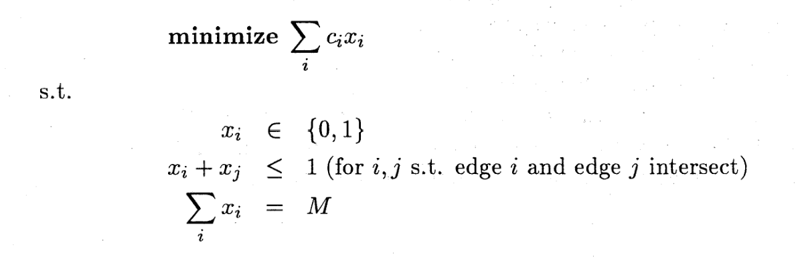
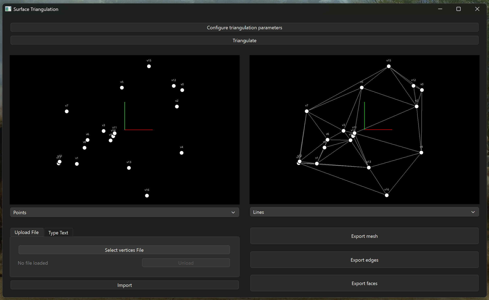

# Synthèse : Triangulation de Surfaces par Programmation Linéaire

## Nom du Projet
**Triangulation Optimale de Surfaces par Programmation Linéaire en Nombres Entiers**

## Description du Problème
La triangulation de surfaces est un problème fondamental en géométrie computationnelle avec de nombreuses applications en infographie, modélisation 3D et analyse par éléments finis. Traditionnellement, l'algorithme de triangulation de Delaunay est utilisé, mais il devient inefficace en trois dimensions ou plus.

Ce projet implémente une approche alternative basée sur la **programmation linéaire en nombres entiers (Integer Programming)** pour générer des triangulations optimales selon différents critères (longueur totale minimale, nombre minimal de triangles, etc.). Cette méthode permet de garantir l'optimalité globale et d'intégrer facilement des contraintes complexes.

---

## 1. Modélisation Mathématique

### Formulation 1 : Problème de Stable Set de i-Simplexes

**Principe :** Cette formulation exploite une propriété des triangulations 2D : il suffit de vérifier que les arêtes ne s'intersectent pas et que leur nombre total est correct.

**Contraintes principales :**
- **Non-intersection des arêtes** : Deux arêtes sélectionnées ne doivent pas s'intersecter
- **Nombre d'arêtes constant** : Le nombre total d'arêtes doit être `M = 3n - k - 3`
  - `n` : nombre de sommets
  - `k` : nombre de sommets sur l'enveloppe convexe

**Variables de décision :** Une variable binaire `x_e` par arête candidate `e`

---

### Fonctions Objectif Implémentées

| Objectif | Formulation | Description |
|----------|-------------|-------------|
| **Minimiser la longueur totale** | `min Σ length(e) * x_e` | Réduit le périmètre total du maillage |
| **Minimiser le nombre de triangles** | `min Σ x_f` | Simplifie le maillage |

---

## 2. Description de l'Interface Homme-Machine (IHM)

L'application propose une interface graphique développée avec **PyQt6** qui suit une architecture **MVC (Model-View-Controller)**.

### Architecture de l'IHM

L'interface est structurée en plusieurs couches :
- **Vues** : Présentation uniquement, sans logique métier
- **Modèles UI** : Données spécifiques à PyQt avec signaux/slots
- **Contrôleurs** : Liaison entre vues et modèles
- **Services Façade** : Accès aux modules core et solvers

---

### Fonctionnalités Principales

#### 1. Vue Principale - Configuration du Problème

**Fonctionnalités :**
- **Chargement de fichiers** : Support de multiples formats (STL, OBJ, PLY, CSV)
- **Configuration des contraintes** : Sélection des contraintes atomiques ou formulations complètes
- **Choix de l'objectif** : Minimisation de longueur ou nombre de triangles
- **Visualisation 3D interactive** : Rendu OpenGL via VisPy pour explorer le maillage

---

#### 2. Vue des Résultats - Triangulation Optimale

**Informations affichées :**
- **Visualisation de la solution** : Maillage triangulé avec arêtes sélectionnées
- **Métadonnées de la solution** :
  - Statut de résolution (Optimal, Infaisable, Limite de temps)
  - Valeur de la fonction objectif
  - Temps de résolution

**Interactions :**
- Rotation, zoom et panoramique 3D
- Export de la solution dans différents formats
- Comparaison avant/après triangulation

---

## 3. Analyse des Résultats Obtenus

### Validation de l'Implémentation

Le projet a été validé à travers plusieurs approches :

#### Tests Unitaires
- **Contraintes Gurobi** : Validation des formulations mathématiques
- **Utilitaires géométriques** : Tests des calculs.

#### Tests d'Intégration
- Validation du flux complet : chargement → résolution → visualisation
- Vérification de la cohérence des solutions (nombre d'arêtes, conservation de surface)

---

### Résultats Obtenus

#### Performance du Solveur

La taille des problèmes résolus est limité par la licence restictive de Gurobi :
- **Taille maximale d'un problème**: 18 sommets
- **Temps de résolution**: < 1 seconde

**Observation :** La Formulation 1 (arêtes) est généralement plus rapide que la Formulation 0 (triangles) car elle contient moins de variables.

---

#### Qualité des Solutions

Les triangulations générées respectent toutes les contraintes imposées :
- Aucune intersection entre arêtes/triangles
- Conservation de la surface totale (Formulation 0)
- Nombre d'arêtes correct : `M = 3n - k - 3` (Formulation 1)

---

#### Perspectives d'Amélioration

1. **Extension 3D complète**
   - Adapter une bibliothèque de géométrie 3D (CGAL, libigl)
   - Implémenter les contraintes pour tétraèdres

2. **Solveurs alternatifs**
   - Support de solveurs open-source (SCIP, CBC)
   - Comparaison de performances entre solveurs

---

### Conclusion

Ce projet démontre la **viabilité de l'approche par programmation linéaire en nombres entiers** pour la triangulation optimale de surfaces. Les résultats obtenus sont :

L'architecture modulaire du projet permet des extensions futures tout en maintenant la qualité et la testabilité du code.

---

**Références :**
- Article principal : "Optimality and Integer Programming Formulations of Triangulations in General Dimension"  
  [https://www.kurims.kyoto-u.ac.jp/~kyodo/kokyuroku/contents/pdf/1068-11.pdf](https://www.kurims.kyoto-u.ac.jp/~kyodo/kokyuroku/contents/pdf/1068-11.pdf)
